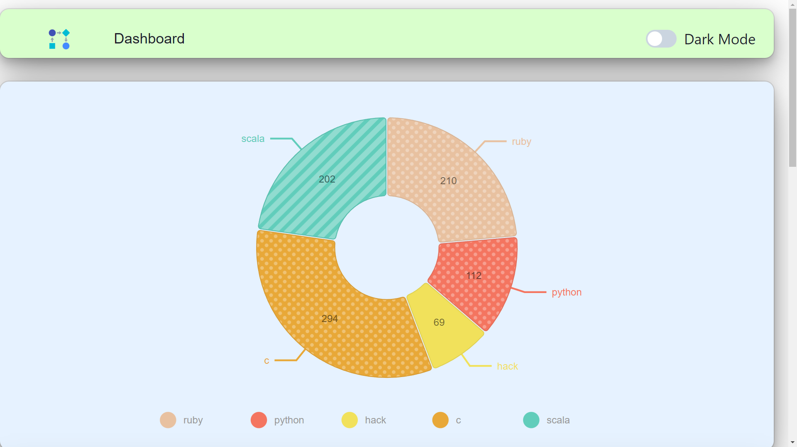
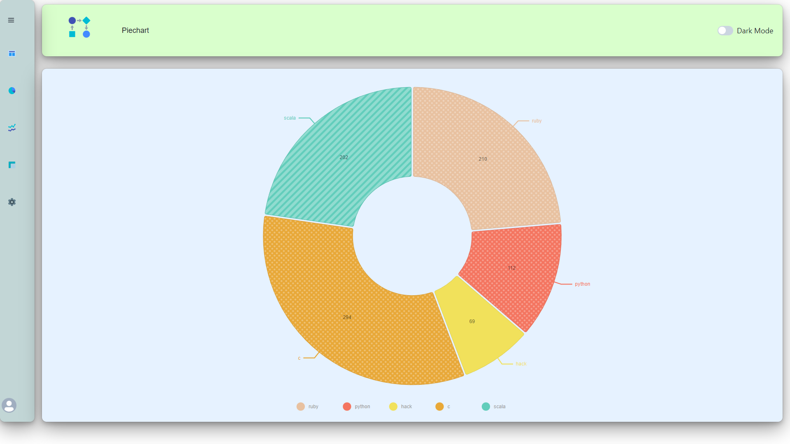
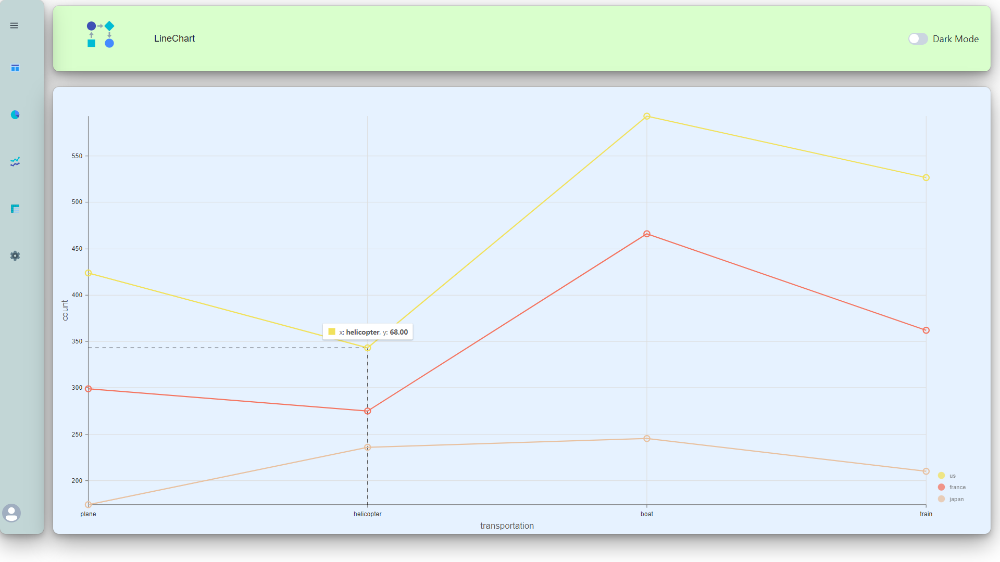
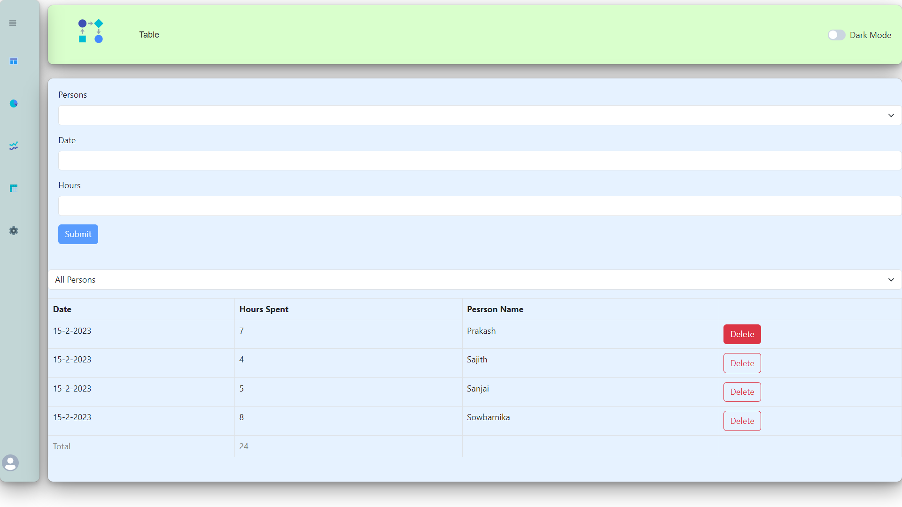

# DashBoard

This project is a highly responsive web application built using React.js and TypeScript. The UI is created using Chakra UI, a popular React component library that provides a set of accessible and customizable UI components. The dashboard charts are implemented using Nivo Charts, a third-party charting library that offers a wide range of data visualization tools.

## Table of Contents

- [Getting Started](#getting-started)
- [Usage](#usage)
- [Contents](#contents)
- [Contributing](#contributing)
- [License](#license)

## Getting Started

To get started with this project, you will need to clone the repository to your local machine and run the following command in the project directory to install the necessary dependencies:

```
npm install
```

Once the dependencies are installed, you can run the following command to start the development server:

```
npm run dev
```

This will launch the web application in your default browser at [http://localhost:3000/](http://localhost:3000/).

## Usage

The web application provides a highly responsive dashboard interface that allows users to view and interact with data in a user-friendly manner. The dashboard includes various charts that are implemented using Nivo Charts, which offers a wide range of chart types and customization options.

To use the dashboard, users can navigate through the various tabs and charts to view data and compare trends. The charts are interactive, allowing users to hover over data points and see detailed information.

## Contents
   - DashBoard
   - PieChart
   - LineChart
   - Intertactive Table
   - DarkMode
   
## DashBoard
   - DeskTop View


   
   
   - Mobile View


   
## PieChart
   
## LineChart
   
## Interactive Table
   
## DarkMode
   

## Contributing

I welcome contributions to this project from the community. If you encounter any bugs or have ideas for new features, please submit an issue or pull request on GitHub.

Please follow these guidelines when contributing to this project:

- Use TypeScript for all code.
- Use Chakra UI for all UI components.
- Use Nivo Charts for all data visualizations.

## License

This project is licensed under the MIT License. See the LICENSE file for details.

## Acknowledgments

I would like to thank the creators of Chakra UI and Nivo Charts for providing such useful libraries to the React community.

## Contact

For any questions or feedback about this project, please contact S.Prakash at saravanaprakash2004@gmail.com.
